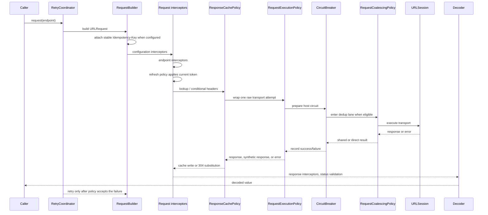

# Policy Interactions

This page fixes the 4.0.0 execution order for request policies. Use it when
combining retry, auth refresh, response cache, coalescing, circuit breaker,
redirect handling, and custom execution policies.

## Request Attempt Order

## Interaction Matrix

| Scenario | 4.0.0 behavior |
| --- | --- |
| Circuit open | Request fails before transport and is considered by the retry policy like any other `NetworkError`. |
| 401 with refresh policy | The current token is applied after request interceptors; one refresh replay uses the fully adapted request with the new token. |
| `RefreshTokenPolicy.appliesTo` returns false | No token is attached and 401 does not trigger refresh replay. |
| Duplicate request coalescing | Coalescing wraps raw transport attempts; auth-refresh replay and outer retry remain outside the shared result. |
| Cache hit | Fresh hits return before transport. Stale hits can revalidate and publish cache revalidation lifecycle events. |
| Authorization response cache write | Stored only when cache writes are enabled and the origin permits authenticated storage with `Cache-Control: public`, `must-revalidate`, or `s-maxage`. |
| 304 with changed `Vary` | The old body and vary snapshot are preserved; only freshness metadata is refreshed. |
| Unsafe cache invalidation | Successful unsafe methods invalidate cached variants for the target URI after refresh replay is decided and before response interceptors/status validation run. |
| Unsafe retry | POST/PUT/PATCH/DELETE retry only when an idempotency key is present, unless the retry policy explicitly opts into method-agnostic behavior. `OPTIONS` and `TRACE` are safe-method defaults alongside GET/HEAD. |
| `IdempotencyKeyPolicy` enabled | The key is generated from the logical request id and reused across every retry attempt. |
| Redirect across origin | `DefaultRedirectPolicy` rejects HTTPS downgrades and 307/308 unsafe-method replay; other cross-origin hops strip built-in and configured sensitive headers. |
| Custom execution policy | Runs after cache lookup/conditional-header preparation and before circuit breaker, coalescing, and URLSession. A policy observes or wraps one executor-owned request; returning a synthetic response bypasses circuit/coalescing/transport for that attempt. Request mutation belongs in a request interceptor. |
| Streaming request | Core `RetryPolicy`, cache, circuit breaker, coalescing, and custom execution policies are bypassed. The current token can be attached before the handshake, but 401 handshakes are not refresh-replayed; `StreamingResumePolicy.lastEventID` is the only built-in resume path. |

## Detailed Six-Policy Compatibility Matrix

The cells below describe what each policy does when the *row* policy fires
on a request that the *column* policy is also active for. Read horizontally:
"if Retry observes a failure under Cache, the result is …".

| ↓ Row fires \ Column active | **Cache** (`ResponseCachePolicy`) | **Retry** (`RetryPolicy`) | **Custom** (`RequestExecutionPolicy`) | **CircuitBreaker** | **Coalescing** | **Refresh** (`RefreshTokenPolicy`) |
| --- | --- | --- | --- | --- | --- | --- |
| **Cache** hit | returns cached body, no further policy fires | retry not consulted | custom policies not invoked | breaker not consulted | coalescer not consulted | refresh not consulted |
| **Cache** stale (revalidate) | dispatches revalidation through transport stack | revalidation failures count toward retry budget | custom policies wrap the revalidation attempt | recorded as a probe under host key | revalidation runs in its own coalescer slot | no token replay on revalidation |
| **Retry** schedules attempt N+1 | new attempt re-enters cache lookup | obeys `maxRetries` and `maxTotalRetries` | policy `retryIndex` increments with the new attempt | shares the host's open/half-open state | new dedup key per attempt; not reused | refresh replay does **not** consume a retry slot |
| **Custom** short-circuits | cache can still write the returned response | retry sees thrown policy errors like transport failures | this is the policy's own role | breaker is bypassed when `next.execute()` is skipped | coalescer is bypassed when `next.execute()` is skipped | refresh replay only sees returned 401 responses |
| **CircuitBreaker** open | request fails before transport with `.configuration(.invalidRequest(...))` | considered as a normal `NetworkError`; usually terminal | custom policy receives the breaker error from `next.execute()` | this is the breaker's own state | coalescer never reached | token already applied — request fails after adapt, before transport |
| **Coalescing** dedup hit | follower receives leader's response (and its cache write) | follower does not retry independently | followers share the leader result inside the same custom-policy call | follower inherits leader's circuit-breaker recording | this is the coalescer's own role | both leader and followers see the same auth header |
| **Refresh** triggered by 401 | unchanged: 401 cache writes are skipped | refresh replay does not consume a retry slot | replay runs through custom policies again with the refreshed request | replay still records breaker outcome | replay opens a fresh dedup key in a refresh-segregated lane | single-flight refresh; concurrent followers wait |

Two invariants the matrix encodes:

1. **Cache wins over every other policy.** A fresh cache hit short-circuits
   the entire stack — retry/breaker/coalescer/refresh do not run. This is
   why the cache lookup is the very first stage after request adaptation.
2. **Refresh replay is orthogonal to the retry budget.** A single
   `RefreshTokenPolicy` replay per request never decrements the
   `RetryPolicy.maxRetries` counter. Consumers that want to cap total
   "user-visible attempts" should plan for `maxRetries + 1` in worst-case
   401 paths.

## Deferred Beyond 4.0.0

Full streaming retry policy, multiple refresh-policy chains, and external
OpenTelemetry exporters are intentionally outside the 4.0.0 GA scope. They
belong in companion packages or a later minor release after the 4.0.0 contract
is tagged.
