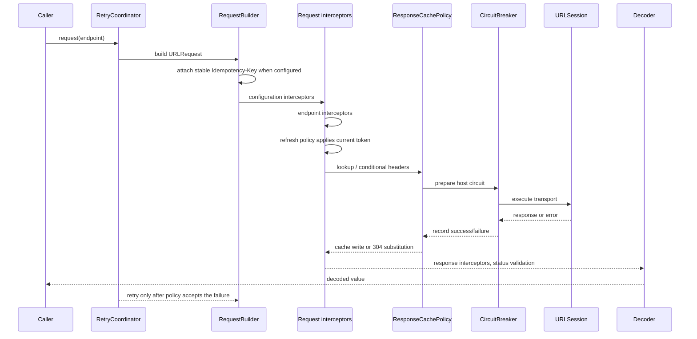

# Policy Interactions

This page fixes the 4.0.0 execution order for request policies. Use it when
combining retry, auth refresh, response cache, coalescing, circuit breaker,
redirect handling, and custom execution policies.

## Request Attempt Order

## Interaction Matrix

| Scenario | 4.0.0 behavior |
| --- | --- |
| Circuit open | Request fails before transport and is considered by the retry policy like any other `NetworkError`. |
| 401 with refresh policy | The current token is applied after request interceptors; one refresh replay uses the fully adapted request with the new token. |
| `RefreshTokenPolicy.appliesTo` returns false | No token is attached and 401 does not trigger refresh replay. |
| Duplicate request coalescing | Coalescing wraps raw transport attempts; auth-refresh replay and outer retry remain outside the shared result. |
| Cache hit | Fresh hits return before transport. Stale hits can revalidate and publish cache revalidation lifecycle events. |
| 304 with changed `Vary` | The old body and vary snapshot are preserved; only freshness metadata is refreshed. |
| Unsafe retry | POST/PUT/PATCH/DELETE retry only when an idempotency key is present, unless the retry policy explicitly opts into method-agnostic behavior. |
| `IdempotencyKeyPolicy` enabled | The key is generated from the logical request id and reused across every retry attempt. |
| Redirect across origin | `DefaultRedirectPolicy` strips credential-bearing headers. |
| Streaming request | Core `RetryPolicy` is bypassed; `StreamingResumePolicy.lastEventID` is the only built-in resume path. |

## Deferred Beyond 4.0.0

Full streaming retry policy, multiple refresh-policy chains, and external
OpenTelemetry exporters are intentionally outside the 4.0.0 GA scope. They
belong in companion packages or a later minor release after the 4.0.0 contract
is tagged.
