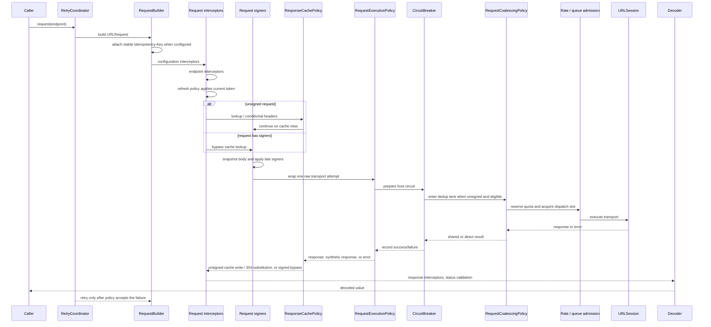

# Policy Interactions

This page documents the policy order in the 6.0 candidate contract. It is not
evidence of tag publication or consumer adoption. Use it when
combining retry, auth refresh, late request signing, response cache,
coalescing, circuit breaker, redirect handling, and custom execution policies.

## Request Attempt Order

The diagram shows the session-authentication path. RequestSecurity credentials
instead acquire their credential envelope and sign after rate/queue admission,
immediately before each physical send; synthetic custom-policy responses do
not acquire credentials.

```mermaid
sequenceDiagram
    participant Caller
    participant Retry as RetryCoordinator
    participant Build as RequestBuilder
    participant Adapt as Request interceptors
    participant Sign as Request signers
    participant Cache as ResponseCachePolicy
    participant Custom as RequestExecutionPolicy
    participant CB as CircuitBreaker
    participant Coal as RequestCoalescingPolicy
    participant Admit as Rate / queue admission
    participant Transport as URLSession
    participant Decode as Decoder

    Caller->>Retry: request(endpoint)
    Retry->>Build: build URLRequest
    Build->>Build: attach stable Idempotency-Key when configured
    Build->>Adapt: configuration interceptors
    Adapt->>Adapt: endpoint interceptors
    Adapt->>Adapt: refresh policy applies current token
    alt unsigned request
        Adapt->>Cache: lookup / conditional headers
        Cache->>Sign: continue on cache miss
    else request has signers
        Adapt->>Sign: bypass cache lookup
    end
    Sign->>Sign: snapshot body and apply late signers
    Sign->>Custom: wrap one raw transport attempt
    Custom->>CB: prepare host circuit
    CB->>Coal: enter dedup lane when unsigned and eligible
    Coal->>Admit: reserve quota and acquire dispatch slot
    Admit->>Transport: execute transport
    Transport-->>Coal: response or error
    Coal-->>CB: shared or direct result
    CB-->>Custom: record success/failure
    Custom-->>Cache: response, synthetic response, or error
    Cache-->>Adapt: unsigned cache write / 304 substitution, or signed bypass
    Adapt-->>Decode: response interceptors, status validation
    Decode-->>Caller: decoded value
    Retry-->>Build: retry only after policy accepts the failure
```

## Interaction Matrix

| Scenario | 6.0 behavior |
| --- | --- |
| Circuit open | If the transport stack is reached, the request fails before sending and is considered by the retry policy like any other `NetworkError`; an eligible cache hit can return earlier. |
| 401 with refresh policy | The current token is applied after request interceptors, before cache lookup; at most one refresh replay per executor attempt uses the fully adapted request with the new token. An outer retry creates a new executor attempt. |
| `RefreshTokenPolicy.appliesTo` returns false | No token is attached and 401 does not trigger refresh replay. |
| Duplicate request coalescing | Coalescing wraps raw transport attempts; auth-refresh replay and outer retry remain outside the shared result. |
| Cache hit | Fresh hits return before transport. Stale hits can revalidate and publish cache revalidation lifecycle events. |
| Authorization response cache write | Stored only when cache writes are enabled and the origin permits authenticated storage with `Cache-Control: public`, `must-revalidate`, or `s-maxage`. |
| 304 with changed `Vary` | The validated body is returned with merged 304 metadata, while the old vary snapshot is invalidated so the next request reaches the origin. |
| Unsafe cache invalidation | Successful unsafe methods invalidate cached variants for the target URI after refresh replay is decided and before response interceptors/status validation run. |
| Unsafe retry | POST/PUT/PATCH/DELETE retry only when an idempotency key is present, unless the retry policy explicitly opts into method-agnostic behavior. `OPTIONS` and `TRACE` are safe-method defaults alongside GET/HEAD. |
| `IdempotencyKeyPolicy` enabled | The key is generated from the logical request id and reused across every retry attempt. |
| Redirect across origin | `DefaultRedirectPolicy` rejects HTTPS downgrades and any proposal retaining an unsafe method; other cross-origin hops strip every caller-prepared original header plus built-in and configured sensitive session headers. |
| Signed request | Signers observe the finalized data or stable file body after interceptors and current-token application. Signed requests bypass response cache, request coalescing, and URLSession caching, and reject every automatic redirect. |
| Request credential provider | Origin-bound API-key/bearer/OAuth credentials use the separate `RequestSecurity` contract, not a session refresh chain. They bypass sharing, automatic redirects and cookie jars. Credential acquisition precedes signing; OAuth renewal is capped once per logical request and only eligible GET/HEAD invalid-token failures replay. See [request credentials](../Sources/InnoNetwork/InnoNetwork.docc/Articles/RequestCredentials.md). |
| Custom execution policy | Runs after cache lookup/conditional-header preparation and before circuit breaker, coalescing, and URLSession. A policy observes or wraps one executor-owned request; returning a synthetic response bypasses circuit/coalescing/transport for that attempt. Request mutation belongs in a request interceptor. Local policy delay is excluded from RFC response-age transport delay. |
| Streaming request | Core `RetryPolicy`, cache, circuit breaker, coalescing, and custom execution policies are bypassed. The current token can be attached before the handshake, but 401 handshakes are not refresh-replayed; `StreamingResumePolicy.lastEventID` is the only built-in resume path. |

## Detailed Six-Policy Compatibility Matrix

The cells below describe what each policy does when the *row* policy fires
on a request that the *column* policy is also active for. Read horizontally:
"if Retry observes a failure under Cache, the result is …".

| ↓ Row fires \ Column active | **Cache** (`ResponseCachePolicy`) | **Retry** (`RetryPolicy`) | **Custom** (`RequestExecutionPolicy`) | **CircuitBreaker** | **Coalescing** | **Refresh** (`RefreshTokenPolicy`) |
| --- | --- | --- | --- | --- | --- | --- |
| **Cache** hit | returns cached body, then caller response interception/decoding | a later interception/decoding failure still reaches outer retry | custom policies not invoked | breaker not consulted | coalescer not consulted | current token already applied; no 401 replay for a successful hit |
| **Cache** stale (foreground revalidate) | dispatches conditional transport | failures reach each caller's outer retry decision | custom policies wrap the attempt | physical result is recorded; only half-open admission owns a probe | joins only when the complete conditional identity matches | an eligible 401 can refresh and replay |
| **Retry** schedules attempt N+1 | new attempt re-enters cache lookup | obeys policy decision and cumulative `maxTotalRetries` | `retryIndex` usually increments; network-change policy can reset it | shares the host's open/half-open state | no retry-index field in the key; matching in-flight identity may join | session refresh replay does **not** consume an outer retry slot |
| **Custom** short-circuits | cache can still write the returned response | retry sees thrown policy errors like transport failures | this is the policy's own role | breaker is bypassed when `next.execute()` is skipped | coalescer is bypassed when `next.execute()` is skipped | refresh replay only sees returned 401 responses |
| **CircuitBreaker** open | an eligible cache hit can precede the breaker; a miss fails with `NetworkError.underlying` wrapping `CircuitBreakerOpenError` | considered by the active retry policy, not a configuration failure | custom policy receives the error from `next.execute()` | this is the breaker's own state | coalescer never reached | token already applied — failure follows adaptation |
| **Coalescing** dedup hit | only raw transport is shared; each caller processes cache/304 handling separately | each caller retries independently | each caller has its own policy chain surrounding the shared transport | closed-state transport is recorded once; half-open probes never join | key includes method, URL, selected headers, body, refresh lane and cache mutation generation | Authorization separates callers by default; excluding it requires equivalent principals |
| **Refresh** triggered by 401 | the triggering 401 is not written before replay | replay does not consume an outer retry slot | replay runs custom policies again | each physical replay records its own outcome | the new request is keyed normally; callers observed during an active refresh are isolated into unique lanes | single-flight refresh; generation-aware followers can reuse the newer token |

Background stale-while-revalidate refreshes also run the custom execution
policy chain, including synthetic responses, transformations, and failures.
Their physical response events use the background revalidation request ID.
They do not invoke the outer logical retry or token-refresh replay loop;
foreground conditional revalidation continues to use those outer policies.

When a policy rebuilds `Response` while retaining the original
`HTTPURLResponse`, cache age uses that physical attempt's timestamps. If it
also replaces the metadata, the executor conservatively uses the interval
from the earliest physical attempt's dispatch through the latest completion.
Only a policy that never invokes transport gets synthetic zero-delay timing.
This excludes admission before the first dispatch and prevents transformations
from making an expired upstream response fresh again.

Two invariants the matrix encodes:

1. **Eligible unsigned cache hits short-circuit the transport stack.** A fresh
   hit bypasses custom transport policies, breaker and coalescer. Token
   application already happened, and response interception/decoding can still
   fail. Signed or request-credential requests are never cache-eligible.
2. **Refresh replay is orthogonal to the retry budget.** At most one session
   `RefreshTokenPolicy` replay occurs per executor attempt, without decrementing
   the outer retry counter. `maxRetries + 1` is not a universal physical-request
   bound: session refresh, custom policies calling `next` repeatedly, and
   network-change attempt-index resets must be considered. `maxTotalRetries`
   bounds cumulative outer retries, not every physical send. RequestSecurity
   OAuth instead has its own once-per-logical-request renewal bound.

## Scope and verification

Full core-policy parity for streaming and multiple session refresh-policy
chains remain unsupported. The OpenTelemetry semantic adapter is available;
vendor SDK exporters and real-backend acceptance remain consumer integration
work, not implicit guarantees from this table.

Source anchors: `RequestExecutor.swift`, `RequestExecutor+Pipeline.swift`,
`RequestExecutor+Transport.swift`, `RequestExecutor+Cache.swift`,
`RetryCoordinator.swift` and `RequestCoalescing/RequestCoalescingPolicy.swift`.
Regression coverage includes `ResiliencePolicyTests`, `RefreshCoalescerRaceTests`,
`CircuitBreakerHardeningTests`, `RequestExecutionPolicyTests`,
`CacheLifecycleRegressionTests` and `RequestSecurityTests`. Local test success
does not replace exact-candidate CI, live-service acceptance or publication.
