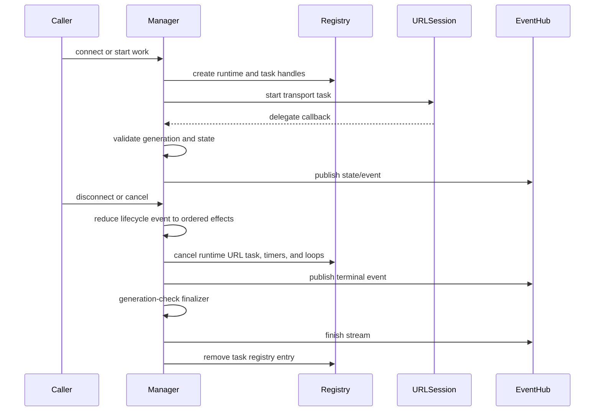

# Task Ownership

This document records ownership and cancellation rules for long-lived
unstructured tasks in InnoNetwork. These tasks sit at framework boundaries
where Foundation delegate callbacks, timers, background URLSession delivery,
and event streams do not map to structured child tasks owned by one caller.

## Policy

- Prefer structured concurrency inside request/response work.
- Use actor-owned `Task` handles when lifecycle work must outlive a single
  caller suspension point.
- Store every long-lived task handle in the component that owns terminal
  cleanup.
- Cancel runtime tasks only from the same cleanup path that also finishes
  event streams and removes registries.
- Keep `Task.detached` rare. It is allowed only when caller cancellation must
  not cancel shared work, such as auth refresh single-flight. New detached
  work needs a short rationale in code or docs.

## Ownership Table

| Task | Owner | Cancel rule | Notes |
|---|---|---|---|
| WebSocket close-handshake timeout | `WebSocketRuntimeRegistry` per task runtime | Cancel from the reducer's terminal cleanup path when close ack or timeout wins | Stale `didOpen` callbacks must reduce to `ignoreStaleCallback` while manual disconnect is in progress. |
| WebSocket reconnect timer | `WebSocketRuntimeRegistry` via `WebSocketReconnectCoordinator` | Cancel when manual disconnect wins, when max attempts fail, or when the task reaches a terminal state | Reconnect timer firing is reduced to a fresh `connecting` generation before URLSession starts. |
| WebSocket heartbeat loop | `WebSocketRuntimeRegistry` via `WebSocketHeartbeatCoordinator` | Cancel on manual disconnect, peer terminal close, ping timeout terminal failure, or reconnect handoff | Heartbeat events are scoped to one connection generation. |
| Event delivery worker tasks | `TaskEventHub` partition/consumer state | Finish partition delivery from the owning manager before registry removal | Slow consumers must not block fast consumers. |
| Background download completion handler | `DownloadManager` background session bridge | Invoke exactly once after restored URLSession events have drained | The app delegate owns receiving the system callback; the manager owns release timing. |
| Foundation delegate callback bridge | `URLSession` delegate adapters and managers | Bridge callback into manager actor, then reduce it with the generation captured for that URLSession task identifier | Delegate callbacks can arrive stale or out of order and must be generation-checked before mutating state or consuming reconnect budget. |
| Auth refresh single-flight | `RefreshTokenPolicy` refresh coordinator | Shared refresh is not cancelled just because one waiting request is cancelled | This is the main approved `Task.detached`-style boundary: caller cancellation must not poison a shared refresh for other requests. |

## Long-Lived Lifecycle

The WebSocket lifecycle reducer is the only production path that decides the
full sequence of runtime cleanup, terminal event publication, event hub finish,
and registry removal. Shortcut paths may ignore stale callbacks, but they must
not partially tear down runtime state that another terminal owner still needs.
