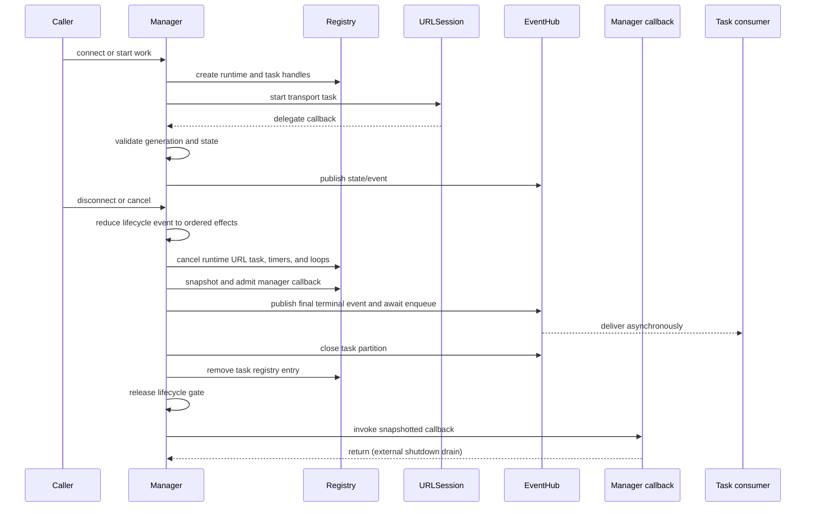

# Task Ownership

This document records ownership and cancellation rules for long-lived
unstructured tasks in InnoNetwork. These tasks sit at framework boundaries
where Foundation delegate callbacks, timers, background URLSession delivery,
and event streams do not map to structured child tasks owned by one caller.

## Policy

- Prefer structured concurrency inside request/response work.
- Use actor-owned `Task` handles when lifecycle work must outlive a single
  caller suspension point.
- Store every long-lived task handle in the component that owns terminal
  cleanup.
- Cancel runtime tasks only from the same cleanup path that also finishes
  event streams and removes registries.
- Publish terminal events before finishing a task's event stream so consumers
  see `finished`/`failed` before end-of-stream.
- Keep `Task.detached` rare. It requires an explicit owner, a drain or terminal
  boundary, and a short rationale in code or docs. Approved lanes are shared
  refresh work that must outlive one waiter, event-delivery isolation, and an
  already-admitted WebSocket manager callback moved to an uncancelled lane
  after its internal runtime worker is cancelled.
- When shared work intentionally outlives a cancelled caller, bridge the
  caller's await separately from the shared task. The caller must return
  promptly on cancellation, while the shared task continues for any remaining
  waiters.

## Ownership Table

| Task | Owner | Cancel rule | Notes |
|---|---|---|---|
| WebSocket close-handshake timeout | `WebSocketRuntimeRegistry` per task runtime | Cancel from the reducer's terminal cleanup path when close ack or timeout wins | Stale `didOpen` callbacks must reduce to `ignoreStaleCallback` while manual disconnect is in progress. |
| WebSocket reconnect timer | `WebSocketRuntimeRegistry` via `WebSocketReconnectCoordinator` | Cancel when manual disconnect wins, when max attempts fail, or when the task reaches a terminal state | Reconnect timer firing is reduced to a fresh `connecting` generation before URLSession starts. |
| WebSocket heartbeat loop | `WebSocketRuntimeRegistry` via `WebSocketHeartbeatCoordinator` | Cancel on manual disconnect, peer terminal close, ping timeout terminal failure, or reconnect handoff | Heartbeat events are scoped to one connection generation; ping timeouts route through the delegate-event queue so callback ordering stays FIFO. |
| Event delivery worker tasks | `TaskEventHub` partition/consumer state | Close the partition from the owning manager before registry removal; consumer workers drain or finish according to the hub boundary | Slow consumers must not block fast consumers. A WebSocket final terminal outcome is forced into every snapshotted consumer queue, but handler delivery remains asynchronous. |
| Prepared WebSocket manager callback | `WebSocketRuntimeRegistry` admission token and callback drain count | Invoke only after the lifecycle gate is released; shutdown clears future registrations and waits for already-admitted callbacks | The prepared callback runs in a fresh uncancelled lane because teardown may already have cancelled its heartbeat/receive worker. Reentrancy tokens prevent callback-initiated shutdown or retry from self-awaiting. |
| Background download completion handler | `DownloadManager` background session bridge | Invoke exactly once after restored URLSession events have drained | The app delegate owns receiving the system callback; the manager owns release timing. |
| Foundation delegate callback bridge | `URLSession` delegate adapters and managers | Bridge callback into manager actor, then reduce it with the generation captured for that URLSession task identifier | Delegate callbacks can arrive stale or out of order and must be generation/state-checked before mutating state or consuming reconnect budget. |
| Auth refresh single-flight | `RefreshTokenPolicy` refresh coordinator | Shared refresh is not cancelled just because one waiting request is cancelled; coordinator deinit cancels any orphaned in-flight refresh | This is the main approved `Task.detached`-style boundary: caller cancellation must not poison a shared refresh for other requests, but the coordinator still owns terminal cleanup. |

The auth-refresh await bridge exists to hold that boundary: awaiting callers
observe their own cancellation immediately, but `RefreshTokenCoordinator`
keeps the in-flight refresh alive until it succeeds, fails, or the coordinator
itself deinitializes. That avoids priority/cancellation inheritance from one
request changing the outcome for other requests sharing the same refresh. The
WebSocket callback lane has a different owner: its registry admission token is
counted until the prepared callback returns, and external manager shutdown
waits for that count to drain.

## Long-Lived Lifecycle

The WebSocket lifecycle reducer is the only production path that decides the
full sequence of runtime cleanup, terminal event enqueue, partition closure,
registry removal, lifecycle-gate release, and manager callback invocation.
During shutdown, an accepted delegate event drains before this sweep begins.
Shortcut paths may ignore stale callbacks, but they must not partially tear
down runtime state that another terminal owner still needs. EventHub enqueue is
not consumer delivery: listeners and `AsyncStream` consumers can finish after
the external shutdown boundary returns.
