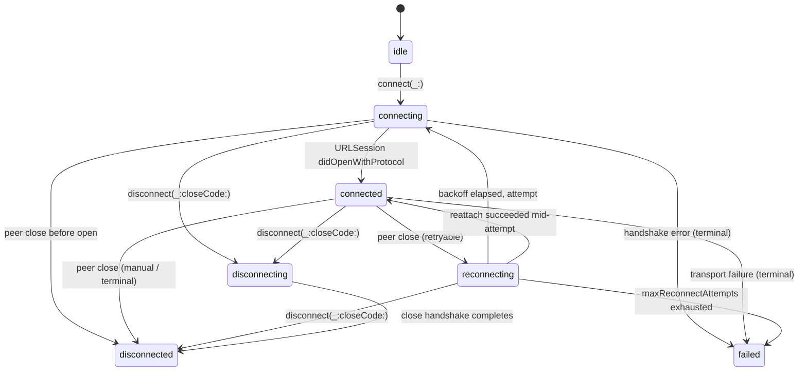

# WebSocket Lifecycle

`WebSocketManager` exposes a typed state machine that mirrors the underlying
`URLSessionWebSocketTask` plus the library's reconnect bookkeeping. Internally,
the lifecycle is driven by a package-scoped reducer that stores connection
generation, reconnect attempt, manual-disconnect, close-code, disposition, and
error payloads together. Public `WebSocketState` remains the stable projection.
This page documents the allowed transitions, the invariants enforced across
reconnect, and the corner cases that informed the current contract.

## State machine



`isTerminal` is `true` only for `disconnected` and `failed`. Every other state is observable
as a "moving" state from the manager's perspective.

Terminal states have no outgoing transition on the same logical task.
``WebSocketManager/retry(_:)`` is a relationship between two tasks: it retires
an eligible terminal source and returns a result containing a fresh task with a
new `id` plus a bounded stream registered before transport resume. It does
not reset or reconnect the source state machine.

The public transition contract is
[`WebSocketState.swift`](../Sources/InnoNetworkWebSocket/WebSocketState.swift):
the `nextStates` and `canTransition(to:)` accessors document which projected
states can follow each other. Production state mutation goes through
[`WebSocketLifecycleReducer.swift`](../Sources/InnoNetworkWebSocket/WebSocketLifecycleReducer.swift),
which returns the next internal lifecycle state plus ordered effects such as
runtime cleanup, event publication, reconnect scheduling, and terminal finish.
Test-only state injection is separated from production mutation via
`restoreStateForTesting(_:)`.

## Reconnect classification

Whether a peer-initiated close transitions to `reconnecting` or `failed` is decided by
[`WebSocketCloseDisposition`](../Sources/InnoNetworkWebSocket/WebSocketCloseDisposition.swift).
The mapping is:

| Disposition | Trigger | Next state |
|-------------|---------|------------|
| `.manual` | Caller invoked `disconnect(_:closeCode:)` | `disconnected` |
| `.peerNormal` | RFC 6455 `1000` (normal closure) | `disconnected` |
| `.peerRetryable` | `1001`, `1005`, `1006`, `1011`, `1012`, `1013`, `1014`, `1015` | `reconnecting` |
| `.peerProtocolFailure` | `1002`, `1003`, `1007`, `1008`, `1009`, `1010` (protocol/policy) | `failed` |
| `.peerApplicationFailure` | custom application close codes (`3000`-`4999`) | `failed` |
| `.handshakeServerUnavailable` | HTTP `429` / `5xx` on upgrade | `reconnecting` |
| `.handshakeUnauthorized` | HTTP `401` specifically | `failed` (caller should refresh auth before reconnecting manually) |
| `.handshakeForbidden` | HTTP `403` specifically | `failed` (caller should refresh authorization before reconnecting manually) |
| `.handshakeTerminalHTTP` | non-auth terminal HTTP `4xx` on upgrade | `failed` |
| `.transportFailure` | NSURLError transient (timeout, DNS, network lost) | `reconnecting` |

Custom close codes (3000-4999) default to **terminal application failures**. If
your app treats one as retryable, observe ``WebSocketTask/closeDisposition`` and
drive an explicit reconnect from your own policy.

## Auto-reconnect invariants

These invariants prevent `_autoReconnectEnabled` from racing against
`disconnect(_:closeCode:)`:

1. **Manual disconnect always wins.** If the caller invokes `disconnect` while
   `reconnecting`, the manager cancels the in-flight reconnect timer and transitions
   directly to `disconnected`. No further attempts are scheduled.
2. **Disconnect during `connecting` is honored.** A manual disconnect during the
   handshake cancels the `URLSessionWebSocketTask` and transitions through
   `disconnecting → disconnected`. The handshake error, if any, is suppressed because the
   caller's intent is to terminate.
3. **`maxReconnectAttempts` is a hard cap.** The cap is checked in
   `WebSocketReconnectCoordinator.reconnectAction(_:_:)` *before* state mutation. Even if
   the count overshoots due to multiple coordinator entries, the internal coordinator
   decision stays at `.exceeded` once the cap is reached. Observers receive one
   authoritative `.error(.maxReconnectAttemptsExceeded)` or
   `.error(.reconnectWindowExceeded)` terminal event, without a preceding synthetic
   `.disconnected` event. (See `WebSocketTask` counter docs in
   [`WebSocketTask.swift`](../Sources/InnoNetworkWebSocket/WebSocketTask.swift) for why
   the internal counter may overshoot.)
4. **Stale callbacks cannot advance generation.** Delegate callback identifiers
   are registered with the connection generation that created the underlying
   `URLSessionWebSocketTask`. Delayed `didOpen`, close, or error callbacks
   whose generation no longer matches are reduced to `ignoreStaleCallback`;
   they do not cancel the close-timeout task, publish a state event, advance
   the current generation, or consume reconnect-attempt budget.
5. **Reconnect attempts use a fresh `URLSessionWebSocketTask`.** Each attempt rebuilds the
   request with the latest interceptors and cookies. Server-issued auth tokens or permissions
   that expired between attempts will surface as a fresh `handshakeUnauthorized` or
   `handshakeForbidden` and stop the loop.

## Terminal cleanup ownership

Terminal cleanup is reducer-driven and ordered. During manager shutdown, the
delegate event that already passed admission drains first; buffered events
that had not passed admission are rejected. For each terminal task, the owner
then performs this sequence:

1. cancel or detach runtime URL tasks, timers, and loops;
2. snapshot the matching manager callbacks and publish the final terminal
   event;
3. wait for that event to be enqueued, close the task event partition, and
   remove the task from the runtime registry;
4. release the task lifecycle gate; and
5. invoke the snapshotted manager callbacks.

An external ``WebSocketManager/shutdown()`` call waits for already-admitted
manager callbacks to return. Task listeners and `AsyncStream` consumers retain
their asynchronous delivery policy, so their already-enqueued terminal event
may be handled after shutdown returns. A reentrant shutdown call from a
manager callback starts teardown and returns so it does not await its own
worker; a later external shutdown call waits for the complete boundary.

The final WebSocket terminal outcome has a stronger saturation guarantee than
ordinary events. It is forced into the task partition and every consumer queue
present in the publication snapshot, including queues configured with
`.dropNewest`; when necessary, the oldest queued event is displaced. The wait
is for enqueue, not handler execution. Any earlier notification in the same
terminal burst and all nonterminal events retain the configured overflow
policy.

Stale callbacks may be ignored after generation/state checks, but they must not
partially cancel close-handshake or reconnect runtime state that is still owned
by the terminal path. Once a task is already `disconnected` or `failed`, late
close/error callbacks are also reduced to `ignoreStaleCallback` and cannot
reschedule reconnect or consume reconnect-attempt budget.

The detailed task owner/cancel table is in
[Task Ownership](TaskOwnership.md). The most important WebSocket-specific rule
is that a delayed `didOpen` received after manual `disconnect` must leave the
close-handshake timeout in place so `didClose` or the timeout finalizer can
complete `.disconnected` cleanup.

## Heartbeat and ping/pong

`WebSocketHeartbeatCoordinator` issues pings on the configured cadence. Each attempt:

1. Emits `WebSocketEvent.ping(attemptNumber:dispatchedAt:)` immediately before the send.
2. Awaits either a pong or the configured `pongTimeout`, whichever comes first.
3. On pong: attempts to publish `.pong(context)` before invoking the
   snapshotted manager handler. Read `context.roundTrip` for RTT measured
   against `dispatchedAt` using `ContinuousClock`.
4. On timeout: queues a heartbeat timeout delegate event, preserving FIFO ordering with
   Foundation open/close/error delegate callbacks. After `maxMissedPongs` consecutive
   timeouts the manager surfaces `WebSocketError.pingTimeout` and transitions to either
   `reconnecting` or `failed` per the reconnect policy.

The `attemptNumber` is per-connection (1-indexed) and resets across reconnects so dashboards
can filter "this socket lost N consecutive pongs".

Pong publication uses the ordinary bounded overflow policy, so a listener may
not receive the event when its queue is saturated. The publication attempt
precedes manager-handler invocation, but delivery remains asynchronous; there
is no guarantee that a listener executes before or after that handler.

## Manual reconnect (escape hatch)

For debugging or auth-refresh flows, you can drive reconnect manually:

```swift
let manager = WebSocketManager(configuration: .safeDefaults())
let task = await manager.connect(url: socketURL)

// After `task` reaches a terminal state:
guard let retryResult = await manager.retry(task) else { return }
let replacement = retryResult.task

// This bounded stream was registered before the replacement transport resumed.
for await event in retryResult.events {
    print(event)
}
```

Explicit retry is one-shot for an eligible terminal source and is accepted only
by the source's owning manager. It returns `nil` for nonterminal,
already-claimed, foreign-manager, or post-shutdown tasks. If shutdown wins
after retry admission, the non-`nil` result's task can already be terminal with
the manager-shutdown connection error, which is observable on the returned
stream. The source task and its per-task
listeners remain terminal and are never retargeted; manager-level handlers
remain installed until manager shutdown.

## Related

- [`WebSocketState.swift`](../Sources/InnoNetworkWebSocket/WebSocketState.swift) — state enum and
  transitions.
- [`WebSocketCloseDisposition.swift`](../Sources/InnoNetworkWebSocket/WebSocketCloseDisposition.swift) —
  close-code classification.
- [`WebSocketReconnectCoordinator.swift`](../Sources/InnoNetworkWebSocket/WebSocketReconnectCoordinator.swift) —
  backoff and attempt accounting.
- [`WebSocketLifecycleReducer.swift`](../Sources/InnoNetworkWebSocket/WebSocketLifecycleReducer.swift) —
  internal reducer state, events, effects, and transition table.
- [Task Ownership](TaskOwnership.md) — owner/cancel rules for reconnect timers,
  close-handshake timeouts, heartbeat loops, event delivery, and delegate bridges.
